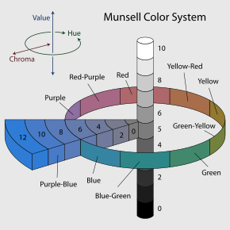
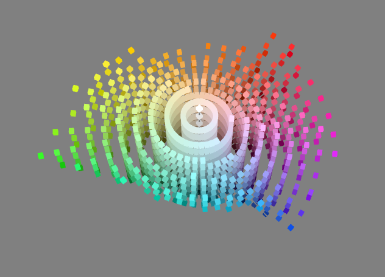
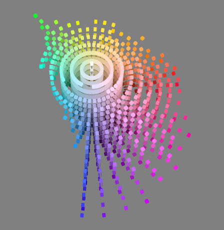
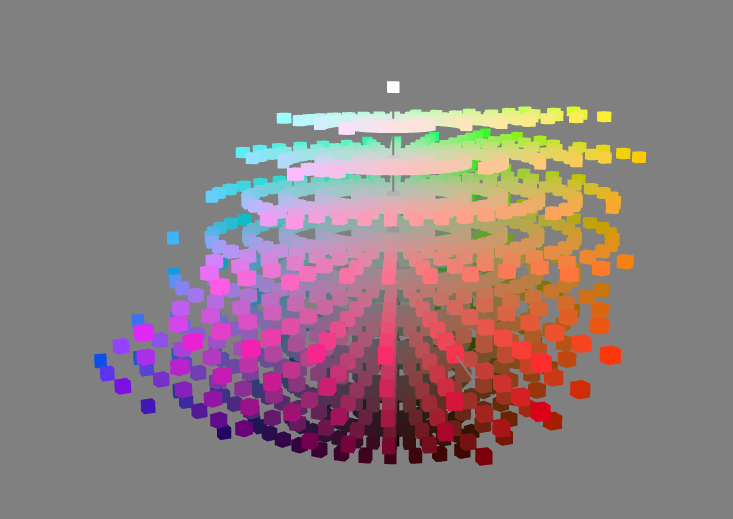
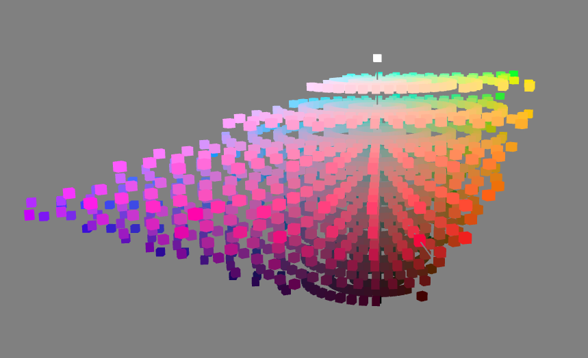
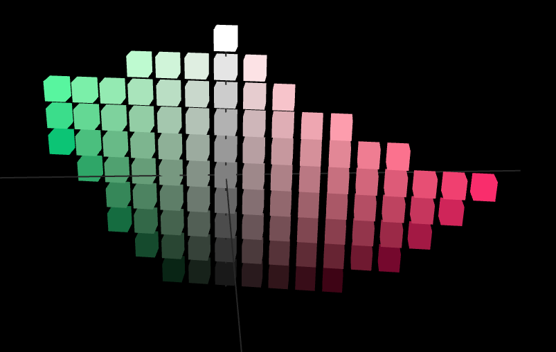
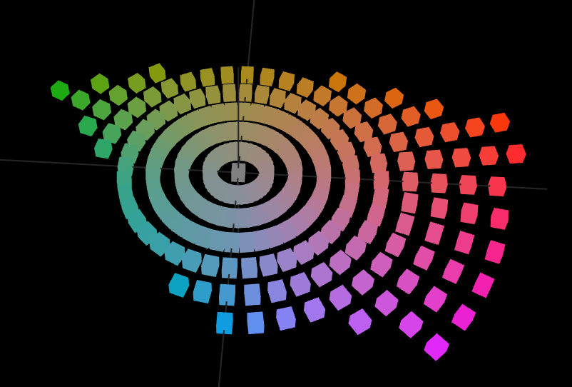

ciecam02   
==========

An easy fast transformer between rgb and ciecam02 color space.
 
Converts color between rgb and a simplified form of the CIECAM02 model named
JCH, wrapped in the numpy arrays in a quick algorithm, for a practical use for
doing algorithms of images, displaying, etc.

introduce
---------

[Munsell color system](https://en.wikipedia.org/wiki/Munsell_color_system)

[CIECAM02](https://en.wikipedia.org/wiki/CIECAM02) approximately linearize 
Moncell color system.

Color type rgb could be use widely in display devices and image formats. The
data form is an integer list [r, g, b], where r g b is among 0 - 255.

CIECAM02 produces multiple correlates, like H, J, z, Q, t, C, M, s. Some of
them represent similar concepts, such as C means chroma and M colorfulness
s saturation correlate the same thing in different density. We need only 3 
major property of these arguments to completely represent a color, and we 
can get other properties or reverse algorithms.

Color type jch is a float list like [j, c, h], where 0.0 < j < 100.0,
0.0 < h < 360.0, and 0.0 < c. the max value of c does not limit, and may 
produce exceeds when transform to rgb. The effective value of max c varies.
Probablly for red color h 0.0, and brightness j 50.0, c reach the valid 
maximum, values about 160.0.

And jch comes from the CIECAM02 model outputs as an float list like
[j, c, h], and some distortion was made to obtain a proper proportion.

j values the same as J, the brightness.

c values the same as C, the chroma.

h compress the original H from 0-400 to 0-360 by simply * 0.9 for 
representing in a polar coordinates.

visual environment variable
----------------------------

Affections was considered in the ciecam02 model and several mesurement was
constructed. We just deal them as constants.

    whitepoint = [95.05, 100.00, 108.88],
    env = [1.0, 0.69, 1.0],
    lightindensity = 80
    bgindensity = 16

And you can [config](#config) these values to simulate a different environment.

implementation
--------------

Implementation relies on numpy, which acts in a high performance of
transformation. Process large image data as array at once.

install
--------

    pip install ciecam02

Usage
-----

Basic functions:

    import numpy as np
    from ciecam02 import rgb2jch, jch2rgb
    rgb = np.array([[56, 34, 199],
                    [255, 255, 255]
                    ])
                      
    rgb2jch(rgb)
                  
    Out[]: array([[ 21.4432157,  74.80048318, 284.3167947 ],
                  [ 99.99968129,  1.49090566, 242.41103965]])
             
    jch2rgb(rgb2jch(rgb))
    
    Out[]:
        array([[ 56,  34, 199],
               [255, 255, 255]], dtype=uint8)

For image analyzing, convert image rgb data to np.array flattened to a 2d array,
then apply the transform:

    import numpy as np
    from ciecam02 import rgb2jch, jch2rgb
    from PIL import Image
    
    im = Image.open("image.png")
    rgb = np.array(im)
    shape = rgb.shape
    jch = rgb2jch(rgb.reshape(-1, 3))
    
    # do the work.
    # ...   
    
    # reverse back to a new image
    rgb = jch2rgb(jch).reshape(shape)
    im = Image.fromarray(rgb)
    im.show()

When doing the reverse transform, rgb values may exceeds. `jch2rgb` control
values in the threshhold of 255. if you want to see those points who are out
of range, use the following functions:

    import numpy as np 
    from ciecam02 import jch2xyz, xyz2infinitergb
    
    ...
    
    xyz = jch2xyz(jch)
    inf_rgb = xyz2infinitergb(rgb)
    
    # then select the exceeded values for your purpose.

functions
---------

The procedures rely on an intermediate representation of xyz color space.
Forward and reverse transform first comes to xyz, then do transformation
to the target space. 

- **rgb2xyz(rgb)** :
  >  returns an xyz 2d array astype `float` shapes [[x, y, z], ...].

- **xyz2rgb(xyz)** :
  >  returns an rgb array astype `uint8`. coud convert to Image object
  >  by `Image.fromarray(rgb)`

- **xyz2infinitergb(xyz)** :
  >  returns an rgb array with exceeded values in a `float` astype. if you
  >  want transform to an image object, you should convert to a `uint8` first. 
    
- **xyz2cam02(xyz)** :
  >  returns the full property of features that cam02 solves, with data undistorted.
  >  [[h, H, J, Q, C, M, s],...]

- **rgb2jch(color)**:
  >  returns a jch array. It is a compound of 'xyz2cam02(rgb2xyz)', then select
  >  J, C, H compressed out in a `float` type.

- **jch2xyz(jch)**:
  >  returns an xyz array in a `float` type.
    

- **jch2rgb(jch)**:
  >  returns rgb array astype `uint8`. Compounds of `xyz2rgb(jch2xyz(jch))`.

config
-------

predefined values like below:

    whitepoint = {'white': [95.05, 100.00, 108.88],
                  'c': [109.85, 100.0, 35.58]}

    env = {'dim': [0.9, 0.59, 0.9],
           'average': [1.0, 0.69, 1.0],
           'dark': [0.8, 0.525, 0.8]}
    lightindensity = {'default': 80.0, 'high': 318.31, 'low': 31.83}
    bgindensity = {'default': 16.0, 'high': 20.0, 'low': 10.0}
    
You can config them by `set_config(whitepoint, env, light, bg)`, 
from the dict keys in each constant:
    
    from ciecam02 import set_config
    set_config('c', 'dim', 'low', 'high')
    
Or you can directly change the global constant, they were predefined like this:

    currentwhite = whitepoint['white']
    currentenv = env['average']
    currentlight = lightindensity['default']
    currentbg = bgindensity['default']
    
Modify for a custom presets:

    currentwhite = [101.0, 100.0, 95]
    currentenv = [0.96, 0.59, 0.99]
    currentlight = 200.0
    currentbg = 18.0
    
Model appearence
-----------------

See some difference from Moncell and CAM02.

# Comparisons

CIECAM02:

Moncell:

CIECAM02:

Moncell:

# Dimensions
    

Lisence
-------

MIT Lisence.
